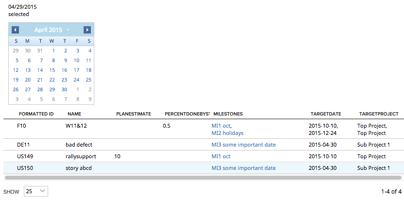

Artifacts with Milestones
=========================

## Overview
This app example shows how stitch data of artifacts and related milestones together and pass a custom json to [Rally.data.wsapi.artifact.Store ](https://help.rallydev.com/apps/2.0/doc/#!/api/Rally.data.wsapi.artifact.Store)
Artifacts are filtered by the presence of Milestones.
Milestones further filtered by TargetDate.

This app is available AS IS. It is not supported by Rally support.

## License

AppTemplate is released under the MIT license.  See the file [LICENSE](./LICENSE) for the full text.

##Documentation for SDK

You can find the documentation on our help [site.](https://help.rallydev.com/apps/2.0/doc/)
